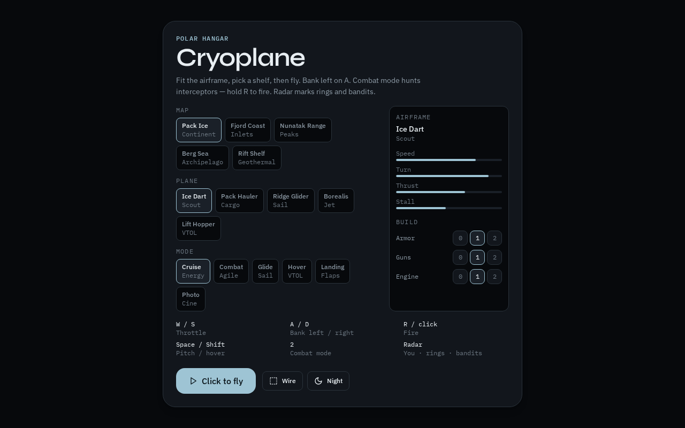
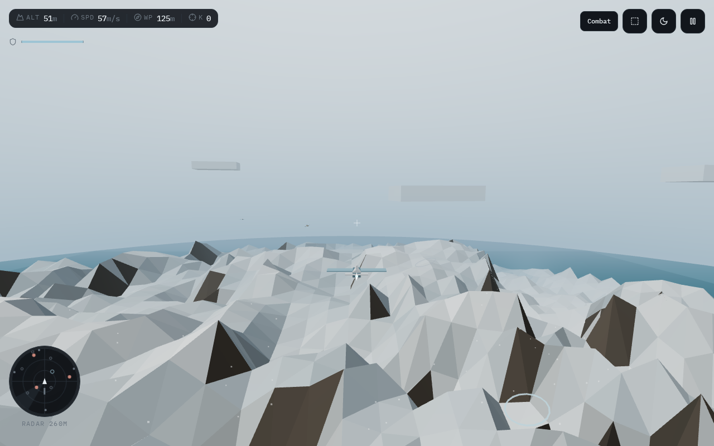

# Cryoplane

Low-poly polar flyer. Hangar opens immediately. Five airframes, five maps, six fly modes, and a three-tier build (armor / guns / engine). Energy flight with spool and stall buffet. Hull crashes on hard impact. Combat mode hunts interceptors. Heading-up radar tracks you, rings, traffic, and bandits.





## Play

```bash
npm install
npm run dev
```

- **W / S** throttle
- **A / D** bank left / right
- **Mouse** look / pitch
- **R** or click (locked) fire
- **Space / Shift** pitch up / down (hover lift on the Hopper)
- **2** combat mode
- **1–6** or **M** fly mode
- **L / B** landing / photo
- **F** wireframe
- **N** day / night

Radar is heading-up, 260 m range. You are the nose. Accent rings are the circuit. Danger dots are interceptors.

## Docs

- [CHANGELOG](CHANGELOG.md)
- [ROADMAP](ROADMAP.md)
- [PLAN](PLAN.md)
- [PROGRESS](PROGRESS.md)
