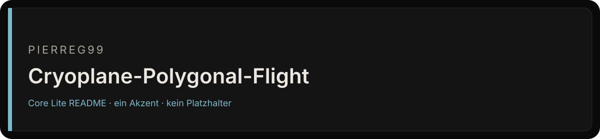

<div align="center">



# Cryoplane-Polygonal-Flight

Cryoplane— low-poly polar continent flyer

[](https://github.com/Pierreg99/Cryoplane-Polygonal-Flight)
[](https://github.com/Pierreg99/Cryoplane-Polygonal-Flight)
[](https://github.com/Pierreg99/Cryoplane-Polygonal-Flight)

</div>

<table>
<tr>
<td width="58%" valign="top">

### Bestand

Cryoplane— low-poly polar continent flyer

Der Default-Branch `main` ist die Fläche, die zählt. Was nicht in diesem Baum liegt, ist kein Feature dieses Repos.

</td>
<td width="42%" valign="top">

### Fakten

| Feld | Wert |
| --- | --- |
| Owner | Pierreg99 |
| Branch | `main` |
| Sichtbarkeit | öffentlich |
| Sprache | TypeScript |
| Archiv | nein |

</td>
</tr>
</table>

## Lesen

1. Default-Branch öffnen.
2. Nur Dateien in diesem Baum als Beleg nehmen.
3. Issues und Diskussionen nur nutzen, wenn sie im Repo eingeschaltet sind.

## Grenze

Keine Qualitätszahl, kein Paketstand und keine Runtime, die nicht als Datei in diesem Repo steht.

<p align="center"><sub>Fläche nach Cryo Core Lite v1.5 · Tokens #0A0A0A / #141414 / #7EB8C9</sub></p>


<details>
<summary>Bisheriger README-Text</summary>

# Cryoplane

Low-poly polar flyer. Hangar opens immediately. Five airframes, five maps, six fly modes, and a three-tier build (armor / guns / engine). Energy flight with spool and stall buffet. Hull crashes on hard impact. Combat mode hunts interceptors. Heading-up radar tracks you, rings, traffic, and bandits.


**Play live:** [pierreg99.github.io/Cryoplane-Polygonal-Flight](https://pierreg99.github.io/Cryoplane-Polygonal-Flight/)

## Play

```bash
npm install
npm run dev
```

- **W / S** throttle
- **A / D** bank left / right
- **Mouse** look / pitch
- **R** or click (locked) fire
- **Space / Shift** pitch up / down (hover lift on the Hopper)
- **2** combat mode
- **1–6** or **M** fly mode
- **L / B** landing / photo
- **F** wireframe
- **N** day / night
- **Mute** in the HUD after you fly (engine note starts on Click to fly)
- **Touch:** left stick thrust/bank · right look pad · fire / climb / descend · Mode

Radar is heading-up, 260 m range. You are the nose. Accent rings are the circuit. Danger dots are interceptors.

## Docs

- [CHANGELOG](CHANGELOG.md)
- [ROADMAP](ROADMAP.md)
- [PLAN](PLAN.md)
- [PROGRESS](PROGRESS.md)

</details>
