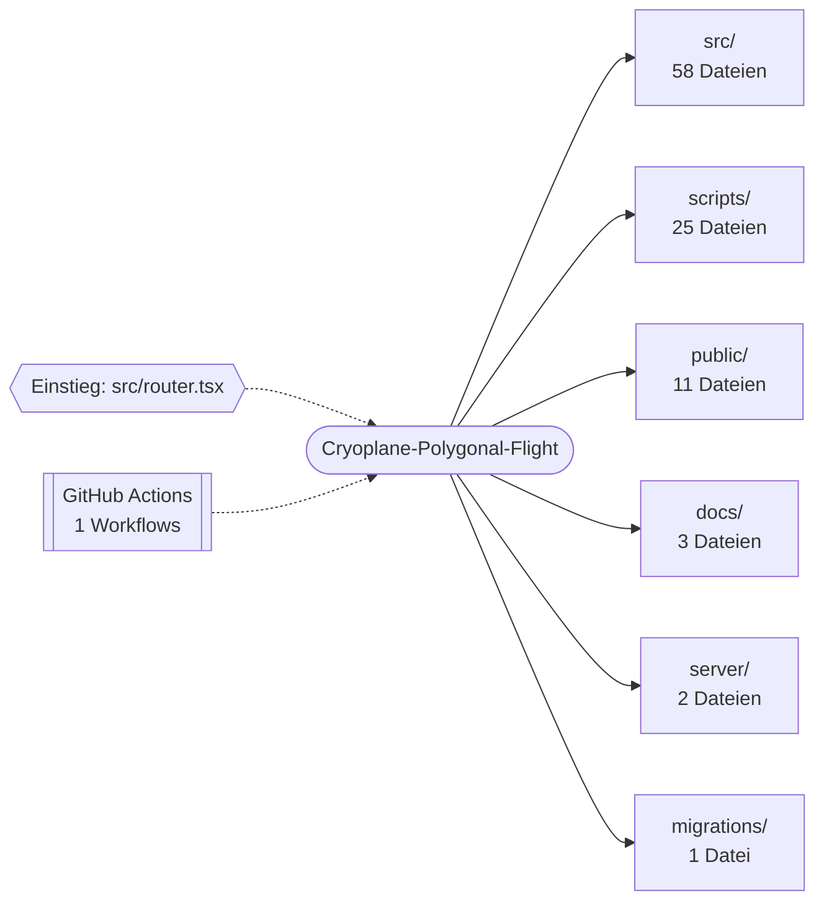
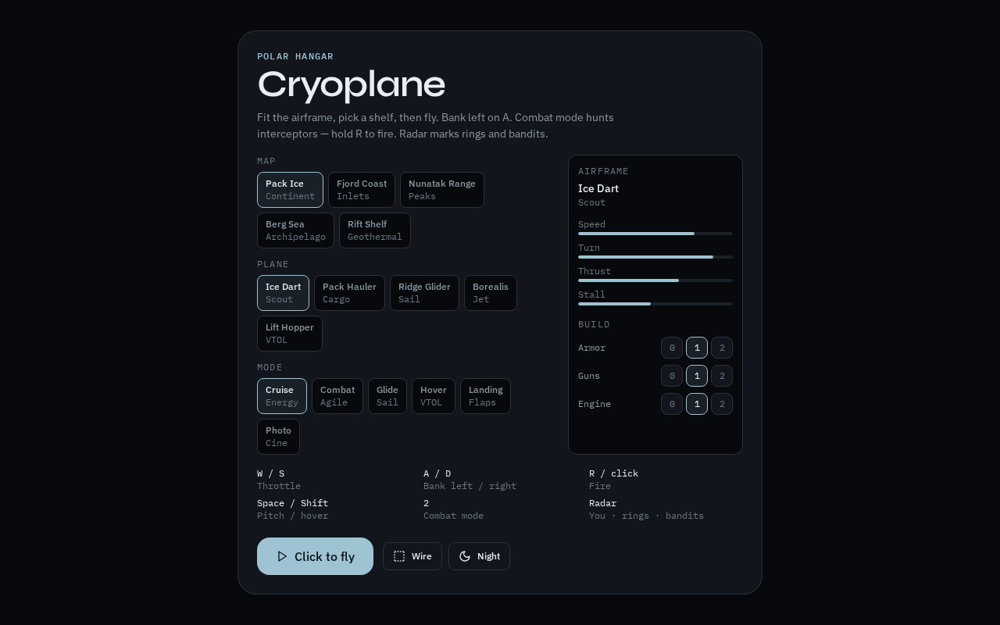
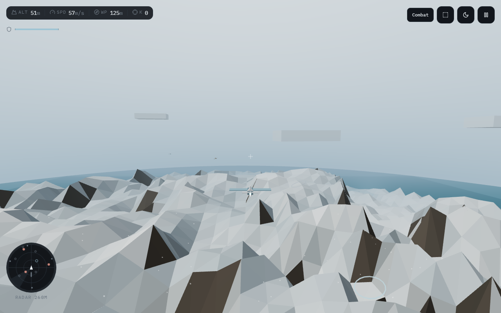

<div align="center">

# Cryoplane

<p><strong>Cryoplane: Low-Poly-Flugspiel über einem polaren Kontinent.</strong></p>
<p>


</p>
<p>
<a href="https://github.com/Pierreg99/Cryoplane-Polygonal-Flight/actions/workflows/pages.yml"></a>
</p>
<p><a href="#schnellstart">Schnellstart</a> · <a href="#projektstruktur">Projektstruktur</a> · <a href="#english-summary">English</a></p>
</div>

---

## Inhaltsverzeichnis

- [Überblick](#überblick)
- [Features](#features)
- [Schnellstart](#schnellstart)
- [Architektur](#architektur)
- [Projektstruktur](#projektstruktur)
- [Dokumentation](#dokumentation)
- [Projektdetails](#projektdetails)
- [English summary](#english-summary)

## Überblick

Cryoplane: Low-Poly-Flugspiel über einem polaren Kontinent.

| Merkmal | Wert |
| --- | --- |
| Sprachen | TypeScript (66%), JavaScript (31%), CSS (2%), HTML (1%) |
| Dateien im Repository | 115 |
| Einstiegspunkte | `src/router.tsx` |
| Version (`package.json`) | 0.7.1 |
| CI-Workflows | 1 |

## Features

- 3D-Rendering mit Three.js
- Deklarative 3D-Szenen mit React Three Fiber
- Full-Stack-App mit TanStack Start
- Typisiertes Routing mit TanStack Router
- Benutzeroberfläche mit React
- Entwicklungsserver und Build mit Vite
- Styling mit Tailwind CSS
- State-Management mit Zustand
- Schema-Validierung mit Zod
- Linting mit ESLint
- Typprüfung mit TypeScript
- Canvas-2D-Rendering
- Klangerzeugung über die Web Audio API
- Lokale Speicherung im Browser (localStorage)
- Gamepad-Unterstützung
- Touch- und Pointer-Steuerung
- Echtzeit-Render-Schleife (requestAnimationFrame)
- Automatisierung über GitHub Actions: `pages.yml`
- Veröffentlichung über GitHub Pages
- 9 Testdateien im Repository
- 5 SVG-Grafiken

## Schnellstart

```bash
git clone https://github.com/Pierreg99/Cryoplane-Polygonal-Flight.git
cd Cryoplane-Polygonal-Flight
```

**Node.js**

```bash
npm install
npm run dev
npm run build
npm run preview
npm run test
npm run lint
npm run typecheck
```

**Shell**

```bash
bash startup.sh
```

<details>
<summary>Alle Skripte aus <code>package.json</code></summary>

| Skript | Befehl |
| --- | --- |
| `dev` | `node scripts/with-app-env.mjs vite dev --host 0.0.0.0 --port 8080` |
| `build` | `node scripts/build-pages.mjs && npm run db:migrate` |
| `db:migrate` | `node scripts/migrate.mjs` |
| `build:dev` | `node scripts/with-app-env.mjs vite build --mode development` |
| `preview` | `node scripts/with-app-env.mjs vite preview` |
| `typecheck` | `tsc --noEmit` |
| `check:auth` | `node scripts/check-auth-invariant.mjs` |
| `test` | `node --test 'scripts/**/*.test.mjs' && node --experimental-strip-types --test src/lib/a...` |
| `lint` | `eslint .` |
| `format` | `prettier --write .` |
| `build:pages` | `node scripts/build-pages.mjs` |
| `preview:pages` | `SKIP_NITRO=1 node scripts/with-app-env.mjs vite preview` |
| `build:vercel` | `NITRO_PRESET=vercel node scripts/with-app-env.mjs vite build && npm run db:migrate` |

</details>

## Architektur

Übersicht der wichtigsten Verzeichnisse nach Anzahl der enthaltenen Dateien.


```mermaid
flowchart LR
    R(["Cryoplane-Polygonal-Flight"])
    R --> D0["src/<br/>58 Dateien"]
    R --> D1["scripts/<br/>25 Dateien"]
    R --> D2["public/<br/>11 Dateien"]
    R --> D3["docs/<br/>3 Dateien"]
    R --> D4["server/<br/>2 Dateien"]
    R --> D5["migrations/<br/>1 Datei"]
    E{{"Einstieg: src/router.tsx"}}
    E -.-> R
    CI[["GitHub Actions<br/>1 Workflows"]] -.-> R
```

## Projektstruktur

```text
Cryoplane-Polygonal-Flight/
├── .github/  (1 Datei)
│   └── workflows/
├── docs/  (3 Dateien)
│   └── images/
├── migrations/  (1 Datei)
│   └── auth/
├── public/  (11 Dateien)
│   ├── __grok/
│   ├── favicon.svg
│   ├── og.jpg
│   └── x-banner.jpg
├── scripts/  (25 Dateien)
│   ├── app-env-plugin.mjs
│   ├── brand-check.mjs
│   ├── brand-check.test.mjs
│   ├── browser-guard.mjs
│   ├── browser-smoke-verdict.mjs
│   ├── browser-smoke-verdict.test.mjs
│   └── … (19 weitere)
├── server/  (2 Dateien)
│   ├── middleware/
│   └── virtual-grok-og-identity.d.ts
├── src/  (58 Dateien)
│   ├── components/
│   ├── game/
│   ├── lib/
│   ├── routes/
│   ├── router.tsx
│   ├── routeTree.gen.ts
│   └── … (1 weitere)
├── .gitignore
├── CHANGELOG.md
├── eslint.config.mjs
├── package-lock.json
├── package.json
├── PLAN.md
├── PROGRESS.md
├── README.md
├── ROADMAP.md
├── startup.sh
├── tsconfig.json
└── vite.config.ts
```

## Dokumentation

- [CHANGELOG.md](CHANGELOG.md)
- [PLAN.md](PLAN.md)
- [PROGRESS.md](PROGRESS.md)
- [ROADMAP.md](ROADMAP.md)

## Projektdetails

Der folgende Abschnitt übernimmt die bisherige Projektdokumentation.

Low-poly polar flyer. Hangar opens immediately. Five airframes, five maps, six fly modes, and a three-tier build (armor / guns / engine). Energy flight with spool and stall buffet. Hull crashes on hard impact. Combat mode hunts interceptors. Heading-up radar tracks you, rings, traffic, and bandits.





**Play live:** [pierreg99.github.io/Cryoplane-Polygonal-Flight](https://pierreg99.github.io/Cryoplane-Polygonal-Flight/)

## Play

```bash
npm install
npm run dev
```

- **W / S** throttle
- **A / D** bank left / right
- **Mouse** look / pitch
- **R** or click (locked) fire
- **Space / Shift** pitch up / down (hover lift on the Hopper)
- **2** combat mode
- **1–6** or **M** fly mode
- **L / B** landing / photo
- **F** wireframe
- **N** day / night
- **Mute** in the HUD after you fly (engine note starts on Click to fly)
- **Touch:** left stick thrust/bank · right look pad · fire / climb / descend · Mode

Radar is heading-up, 260 m range. You are the nose. Accent rings are the circuit. Danger dots are interceptors.

## Docs

- [CHANGELOG](CHANGELOG.md)
- [ROADMAP](ROADMAP.md)
- [PLAN](PLAN.md)
- [PROGRESS](PROGRESS.md)

## English summary

Cryoplane: low-poly flyer over a polar continent.

Clone the repository and follow the commands in [Schnellstart](#schnellstart); the [project layout](#projektstruktur) shows where the code lives. Further documents are listed under [Dokumentation](#dokumentation).
